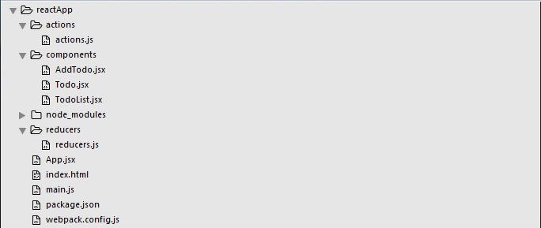

# Concept of flux and Redux intro

## Learning Competencies
At the end of this topic you will be able to learn about

- Understand the flux concept
- Understand about flux elements
- Difference between flux and MVC pattern
- Uni-directional and bi-directional data flow 
- Understand Redux basics
- Flux vs Redux

## Overview

## Flux

Flux is the application architecture that Facebook uses for building client-side web applications. It complements React’s composable view components by utilizing an unidirectional data flow. It’s more of a pattern rather than a formal framework, and you can start using Flux immediately without a lot of new code.

## Flux elements
- Dispatcher
- Store
- Action
- View

### Dispatcher

The dispatcher receives actions and dispatches them to stores that have
registered with the dispatcher. **Every store will receive every action.**
There should be only one singleton dispatcher in each application.

Example:

1. User types in title for a todo and hits enter.
2. The view captures this event and **dispatches** an "add-todo" action
   containing the title of the todo.
3. **Every store** will then receive this action.

### Store

A store is what holds the data of an application. Stores will register
with the application's dispatcher so that they can receive actions. **The
data in a store must only be mutated by responding to an action.** There
should not be any public setters on a store, only getters. Stores decide
what actions they want to respond to. **Every time a store's data changes it
must emit a "change" event.** There should be many stores in each
application.

Examples:

1. Store receives an "add-todo" action.
2. It decides it is relevant and adds the todo to the list of things
   that need to be done today.
3. The store updates its data and then emits a "change" event.

### Actions

Actions define the internal API of your application. They capture the ways
in which anything might interact with your application. They are simple
objects that have a "type" field and some data.

Actions should be semantic and descriptive of the action taking place.
They should not describe implementation details of that action. Use
"delete-user" rather than breaking it up into "delete-user-id",
"clear-user-data", "refresh-credentials" (or however the process works).
Remember that all stores will receive the action and can know they need
to clear the data or refresh credentials by handling the same "delete-user"
action.

Examples:

1. When a user clicks "delete" on a completed todo a single "delete-todo"
   action is dispatched:

```
  {
    type: 'delete-todo',
    todoID: '1234',
  }
```

### Views

Data from stores is displayed in views. Views can use whatever framework
you want (In most examples here we will use React). **When a view uses data
from a store it must also subscribe to change events from that store.** Then
when the store emits a change the view can get the new data and re-render.
If a component ever uses a store and does not subscribe to it then there
is likely a subtle bug waiting to be found. Actions are typically dispatched
from views as the user interacts with parts of the application's interface.

Example:

1. The main view subscribes to the TodoStore.
2. It accesses a list of the Todos and renders them in a readable format for
   the user to interact with.
3. When a user types in the title of a new Todo and hits enter the view tells 
   the Dispatcher to dispatch an action.
4. All stores receive the dispatched action.
5. The TodoStore handles the action and adds another Todo to its internal
   data structure, then emits a "change" event.
6. The main view is listening for the "change" event. It gets the event,
   gets new data from the TodoStore, and then re-renders the list of Todos
   in the user interface.
   
## Flow of data

We can piece the parts of Flux above into a diagram describing how data flows
through the system.

1. Views send actions to the dispatcher.
2. The dispatcher sends actions to every store.
3. Stores send data to the views.
  - _(Different phrasing: Views get data from the stores.)_


_(There is also another node in the diagram accounting for actions that do not
originate from views, which is common)_

## Redux

Flux is a pattern and Redux is a library.

Flux is a fancy name for the observer pattern modified a little bit to fit React, but Facebook released a few tools to aid in implementing the Flux pattern, so the following is the difference between using these tools (which is commonly referred to as using Flux) and using Redux.

- Both **Flux and Redux have actions**.In Flux, an action is a simple JavaScript object, and that’s the default case in Redux too, but when using Redux middleware, actions can also be functions and promises.
- With **Flux it is a convention to have multiple stores per application;** each store is a singleton object. **In Redux, the convention is to have a single store per application**, usually separated into data domains internally (you can create more than one Redux store if needed for more complex scenarios).
- **Flux has a single dispatcher** and all actions have to pass through that dispatcher. It’s a singleton object. A Flux application cannot have multiple dispatchers. This is needed because a Flux application can have multiple stores and the dependencies between those stores need a single manager, which is the dispatcher. **Redux has no dispatcher entity.** Instead, the store has the dispatching process baked in. A Redux store exposes a few simple API functions, one of them is to dispatch actions.
- In Flux, the logic of what to do on the data based on the received action is written in the store itself. In Redux, the logic of what to do on the data based on the received actions is in the reducer function that gets called for every action that gets dispatched (through the store API). A store can’t be defined without a reducer function.
- The other bigger constraint is that the store’s state cannot be mutable (or really, shouldn’t be). There is no such constraint in Flux, you can mutate the state as you wish. The state’s immutability, in Redux, is achieved easily by making the reducers pure functions (with no side effects). Redux reducers always copy the state they receive and returns a modified version of the state’s copy, not the original object itself. While this is a big constraint, it makes life much easier long term.

A **Redux reducer** is a simple function that receives the previous state and one action, and it returns the new state based on that action. In a Redux app, you can split your reducer into simpler functions as you would do with any other function. The smartest player in Redux is the reducer.

Look at the below picture for better understanding 


## Code along 

- Install Redux via terminal.
```console
npm install --save react-redux
```
- Create folders and files for our actions, reducers and components. After we are done with it, this is how the folder structure will look like.



- **Actions:** Actions are JavaScript objects that use type property to inform about the data that should be sent to the store. We are defining ADD_TODO action that will be used for adding new item to our list. The addTodo function is action creator that returns our action and sets an id for every created item.
```js
actions/actions.js
export const ADD_TODO = 'ADD_TODO'

let nextTodoId = 0;

export function addTodo(text) {
   return {
      type: ADD_TODO,
      id: nextTodoId++,
      text
   };
}
```
- **Reducers**:
While actions only trigger changes in the app, the reducers specify those changes. We are using switch statement to search for a ADD_TODO action. The reducer is a function that takes two parameters (state and action) to calculate and return updated state. The first function will be used to create new item, while the second one will push that item to the list. At the end we are using combineReducers helper function where we can add any new reducers we might use in the future.
```js
reducers/reducers.js
import { combineReducers } from 'redux'
import { ADD_TODO } from '../actions/actions'

function todo(state, action) {
   switch (action.type) {
    
      case ADD_TODO:
         return {
            id: action.id,
            text: action.text,
         }
            
      default:
      return state
   }
}

function todos(state = [], action) {
   switch (action.type) {
    
      case ADD_TODO:
         return [
            ...state,
            todo(undefined, action)
         ]
            
      default:
      return state
   }
}

const todoApp = combineReducers({
   todos
})

export default todoApp
```
- **Store**
The store is the place that holds the app's state. It is very easy to create store once you have reducers. We are passing store property to the provider element which wraps our route component.

#### main.js
```
import React from 'react'

import { render } from 'react-dom'
import { createStore } from 'redux'
import { Provider } from 'react-redux'

import App from './App.jsx'
import todoApp from './reducers/reducers'

let store = createStore(todoApp)

let rootElement = document.getElementById('app')

render(

   <Provider store = {store}>
      <App />
   </Provider>,
    
   rootElement
)
```
- **Root Component**: 
The App component is the root component of the app. Only root component should be aware of a redux. The important part to notice is the connect function which is used for connecting our root component App to the store. This function takes select function as an argument. The select function takes state from the store and returns the props (visibleTodos) that we can use in our components.

#### App.js
```
import React, { Component } from 'react'
import { connect } from 'react-redux'
import { addTodo } from './actions/actions'

import AddTodo from './components/AddTodo.jsx'
import TodoList from './components/TodoList.jsx'

class App extends Component {
   render() {
      const { dispatch, visibleTodos } = this.props
    
      return (
         <div>
            
            <AddTodo
               onAddClick = {text ⇒
               dispatch(addTodo(text))}
            />
                
            <TodoList todos = {visibleTodos}/>
            
         </div>
      )
   }
}

function select(state) {
   return {
      visibleTodos: state.todos
   }
}

export default connect(select)(App)
```
- **Other Components**
These components shouldn't be aware of the redux.

#### components/AddTodo.js
```js
import React, { Component, PropTypes } from 'react'

export default class AddTodo extends Component {
   render() {
      return (
         <div>
            <input type = 'text' ref = 'input' />
                
            <button onClick = {(e) ⇒ this.handleClick(e)}>
               Add
            </button>
                
         </div>
      )
   }

   handleClick(e) {
      const node = this.refs.input
      const text = node.value.trim()
      this.props.onAddClick(text)
      node.value = ''
   }
}
```

#### components/Todo.js
```js
import React, { Component, PropTypes } from 'react'

export default class Todo extends Component {
   render() {
      return (
         <li>
            {this.props.text}
         </li>
      )
   }
}
```
#### components/TodoList.js
```js
import React, { Component, PropTypes } from 'react'
import Todo from './Todo.jsx'

export default class TodoList extends Component {
   render() {
      return (
         <ul>
            {this.props.todos.map(todo ⇒
               <Todo
               key = {todo.id}
               {...todo}
               />
            )}
         </ul>
      )
   }
}
```
When we start our app we will be able to add items to our list.

## Exploration
- Redux official [site](https://redux.js.org/basics)
- Flux [Overview](https://facebook.github.io/flux/docs/in-depth-overview.html#content)
- [Redux vs MVC](https://blog.gisspan.com/2017/02/Redux-Vs-MVC,-Why-and-How.html)
- Redux [video](https://egghead.io/lessons/react-redux-the-single-immutable-state-tree) tutorial from the creator itself.
- another best Redux [video](https://www.youtube.com/watch?v=DiLVAXlVYR0&list=PL6gx4Cwl9DGBbSLZjvleMwldX8jGgXV6a) tutorial